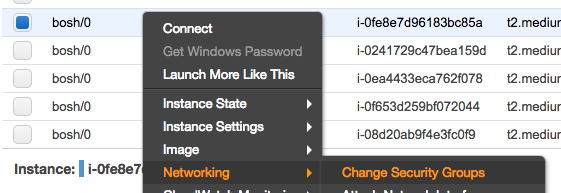

## SSH into the Concourse VM

We can SSH directly into the Concourse VM using a Makefile target in `paas-cf`. This copies the Concourse VM's SSH key from a state bucket on S3, prints the VM's sudo password, and makes the SSH connection.

```
make ssh_concourse
```

---

## Connecting bosh_cli to BOSH

### Primary solution: use a Concourse task

A Makefile task in `paas-cf` connects you to a one-off task in Concourse that's already logged into BOSH and has the deployment set using the CF manifest:

```
make dev bosh-cli
```

### Backup solution: tunnel BOSH commands through the Concourse VM

If the Concourse VM is running but you can't use a Concourse task, you can still use the Concourse VM as a gateway to access the BOSH.

`cd` into the `paas-cf` directory, save the below as a script and run it. This tunnels through the Concourse VM, SSH forwards the BOSH port to the BOSH VM, logs you into BOSH and and drops you into a `bash` session to run `bosh` commands:

```bash
#!/bin/bash

set -eu

trap 'make dev stop-tunnel; rm -f /tmp/manifest.yml' EXIT

echo "Making SSH tunnel to Bosh..."
make dev tunnel TUNNEL=25555:10.0.0.6:25555

echo
BOSH_PASSWORD=$(aws s3 cp "s3://gds-paas-${DEPLOY_ENV}-state/bosh-secrets.yml" - | awk '/bosh_admin_password/ {print $2}')
bundle exec bosh -t localhost login admin -- "${BOSH_PASSWORD}"
bundle exec bosh target localhost

echo
echo "Downloading CloudFoundry manifest..."
aws s3 cp "s3://gds-paas-${DEPLOY_ENV}-state/cf-manifest.yml" /tmp/manifest.yml
bundle exec bosh deployment /tmp/manifest.yml

echo
echo "INSTRUCTIONS"
echo "You are now in a local shell"
echo "The bosh CLI is logged into the remote BOSH"
echo "Use 'bundle exec bosh' as your BOSH CLI commands"
echo "e.g., bundle exec bosh vms"
bash
```

### Backup solution: forward BOSH commands directly to the BOSH VM

If the Concourse VM is down, you can achieve port forwarding by appending `-L 25555:localhost:25555` to SSH commands. See [the emergency instructions for SSHing into BOSH](#backup-method-connecting-directly-to-bosh).

### Using `bosh ssh`

If using the backup solutions above, you have to specify a gateway when using `bosh ssh` commands. 

If you're SSHed through Concourse:

1. Set its public IP as `CONCOURSE_IP`.
2. Download the Concourse SSH key with: `aws s3 cp "s3://gds-paas-${DEPLOY_ENV}-state/concourse_id_rsa" /tmp/concourse_id_rsa && chmod 400 /tmp/concourse_id_rsa`
3. Append `--gateway_host "${CONCOURSE_IP}" --gateway_user vcap --gateway_identity_file /tmp/concourse_id_rsa` to `bosh ssh` commands.

If you're SSHed directly into BOSH:

1. Set its public IP as `BOSH_IP`.
2. Download the BOSH SSH key with: `aws s3 cp "s3://gds-paas-${DEPLOY_ENV}-state/bosh_id_rsa" /tmp/bosh_id_rsa && chmod 400 /tmp/bosh_id_rsa`
3. Append `--gateway_host "${BOSH_IP}" --gateway_user vcap --gateway_identity_file /tmp/bosh_id_rsa`to `bosh ssh` commands.

---

## SSH into the BOSH VM

### Primary solution: tunnel through the Concourse VM

In ordinary circumstances we use the Concourse VM as a gateway to access the BOSH VM. There is a Makefile task in `paas-cf` to establish this SSH connection.  This copies SSH keys for the Concourse and BOSH VMs from a state bucket on S3, prints the BOSH VM's sudo password, and makes the SSH connection.

```
make ssh_bosh
```

### Backup method: connecting directly to BOSH

If the Concourse VM is unavailable and creating new VMs is impossible or would take too long, you can make the BOSH VM accessible to our IP addresses. This should be a last-resort and temporary measure.

Go into the AWS Web Console. Go into EC2 and add the `office-access-ssh` Security Group to the `bosh/0` VM. See the below screenshot for where to find Security Group settings.



This change allows you to SSH into the BOSH VM from the Office or VPN. To do that, save the below as a script and run it.

```bash
#!/bin/bash

BOSH_KEY=/tmp/bosh_id_rsa.$RANDOM
trap 'rm -f ${BOSH_KEY}' EXIT
aws s3 cp "s3://gds-paas-${DEPLOY_ENV}-state/bosh_id_rsa" ${BOSH_KEY} && chmod 400 ${BOSH_KEY}

BOSH_IP=$(aws ec2 describe-instances \
              --filters 'Name=tag:Name,Values=*' "Name=key-name,Values=${DEPLOY_ENV}_bosh_ssh_key_pair" \
              --query 'Reservations[].Instances[].PublicIpAddress' --output text)
echo
aws s3 cp "s3://gds-paas-${DEPLOY_ENV}-state/bosh-secrets.yml" - | \
  ruby -ryaml -e 'puts "Sudo password is " + YAML.load(STDIN)["secrets"]["bosh_vcap_password_orig"]'
echo

SSH_OPTIONS='-o StrictHostKeyChecking=no -o UserKnownHostsFile=/dev/null -o ServerAliveInterval=60'
# shellcheck disable=SC2086
ssh ${SSH_OPTIONS} -i "${BOSH_KEY}" vcap@"${BOSH_IP}"
```

**Important: remove the `office-access-ssh` security group from `bosh/0` once you're done.**

If you want to use the BOSH CLI, append `-L 25555:localhost:25555` to the final SSH command and then target the CLI at `localhost`.
