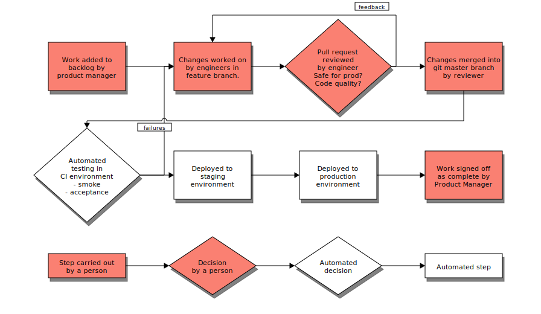
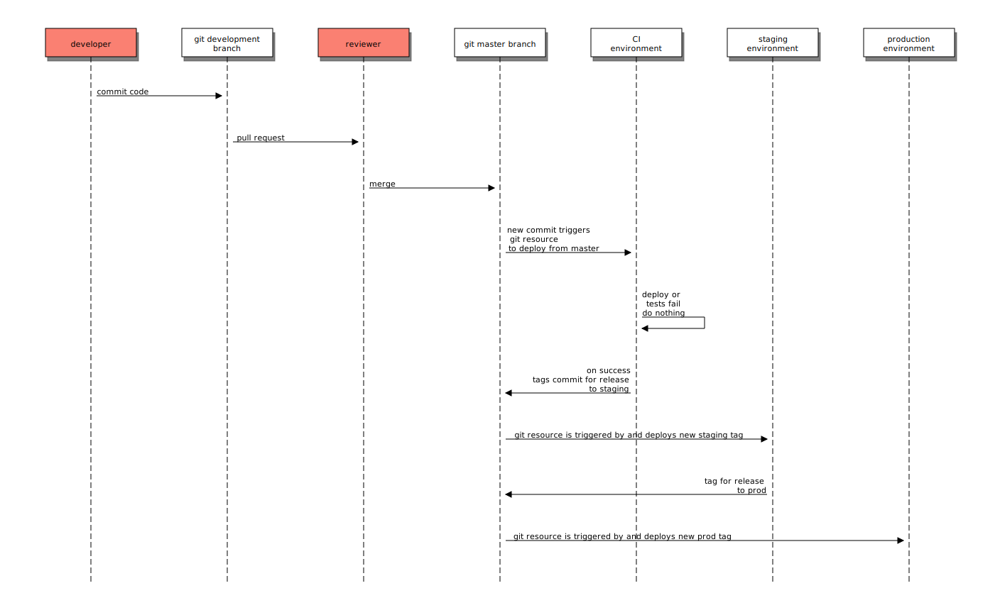

# Development process

[TOC]



- The Product Manager makes decisions on what work (features, bugs) is
  prioritised
- The team make the necessary changes in their own development environments and
  branches
- The changes are [reviewed](#pull-requests) by an engineer
- The reviewer merges the changes into the master branch of the repository
- The latest revision of the code is automatically tested on staging using the
  Cloud Foundry smoke and acceptance tests to ensure that basic user functions
  still work.
- The changes are deployed to the production environment.

The diagram below shows how this process is implemented using git tags. It does
not show some planned improvements, such as using git commit signatures to
ensure that commits have been reviewed before deploying them.



[Full size version](../diagrams/release-sequence.svg)

# Pairing

We pair on all stories to ensure that people don't get stuck on the same
types of work and that there is a good distribution of knowledge across the
team. We aim to rotate pairs regularly by:

- changing pairs when you've been on a story for more than 2 days

- joining someone on an existing story that doesn't have a pair instead of
  picking up new work

Please tick the [pair stair][] on our board when you rotate so that rotation
are evenly distributed.

[pair stair]: http://pairstair.com/

# Story kick-off

Kick-offs are an opportunity to clarify the scope of a story and raise any
technical suggestions or concerns before work starts. They should include a
check if the story being kicked off will likely conflict with any of the
stories already in progress and therefore likely cause conflicts.

If the story is a spike, it should be made clear what the questions we want to answer
are, and what specific outputs we need to cover in the summary at the end of the spike. Spikes *must* be
reviewed after 2 days.

When a pair starts a new story they should arrange a kick-off with the Product
Owner or Business Analyst, Tech Arch or Tech Lead, and anyone else from the team
that is interested. Slack is a good way to let the team know.


# Commit messages

Commit messages are very useful as documentation, so please take time to
detail what you are changing and more importantly why. The [GDS git style
guide][] explains this in more detail.

[GDS git style guide]: https://github.com/alphagov/styleguides/blob/master/git.md

If something is worth detailing in a pull request description then it is
also worth detailing in a commit message. Commit messages will live with the
repository forever and can be discovered using [git pickaxe][], whereas over
time a project may move from GitHub or Pivotal Tracker. You can often
copy/paste well written commit messages to form the pull request
description.

[git pickaxe]: http://www.philandstuff.com/2014/02/09/git-pickaxe.html

# Pull requests

We peer review all code to ensure that it works as expected and is clear for
the team to understand. All work, no matter how small, should use git
branches and GitHub pull requests. [Anna's blog post][] explains how to
raise a good pull request.

[Anna's blog post]: http://www.annashipman.co.uk/jfdi/good-pull-requests.html
[this template]: https://github.com/alphagov/paas-cf/blob/master/.github/PULL_REQUEST_TEMPLATE.md

When you create a pull request please:

- use [this template][] for the description so that it is easier for
  the reviewer to understand and test your changes

- prefix the subject with the story ID from Pivotal Tracker (format:
  `[#12345678] My pull request`) so that we have a record of all the changes
  for a given story

- put the pull request URL into the Pivotal Tracker story so that
  people can find it and understand the progress of a story before it is
  merged

There is a dashboard near our desks that displays open pull requests using
[Fourth Wall][]. Reviewing outstanding pull requests should be a priority
over picking up new work. As the author of a pull request you may still need
to chase this and you need to watch your email for comments on your pull
request. Pull requests should be reviewed by somebody that hasn't already
worked on the story. When reviewing a pull request please "assign" yourself
on GitHub, so that someone else doesn't duplicate effort.

[Fourth Wall]: https://github.com/alphagov/fourth-wall

# Merging Pull requests

Once review is complete, and all status checks have passed (Travis etc),
a pull request can be merged.

PRs to the [paas-cf][] and [paas-bootstrap][] repositories should be merged using a GPG signed commit.
This means that merges can't be done in the Github UI - they have to be done locally,
using the `merge_pr` make task in each repository.

We only use signed revisions of [paas-cf][] and [paas-bootstrap][] from our concourse pipelines.
This is enforced by the gpg functionality in Concourse Git resource. We may require signing merges in other
repositories in future.

[paas-cf]: https://github.com/alphagov/paas-cf
[paas-bootstrap]: https://github.com/alphagov/paas-bootstrap
[paas-git-resource]: https://github.com/alphagov/paas-git-resource

## Initial setup for signing commits

Ensure you have gpg setup on your machine (see [guides/GPG](../guides/GPG) for
details).

By default, git will look for a secret key in your local keyring that exactly
matches your configured committer name and email address (such as
`Testy McTest <test@example.com>`). If this is not sufficient, you can
configure the signing key that git will use:

```sh
# To apply to all git repos:
git config --global user.signingkey <key_id>

# ... or to apply to the current repo only:
git config user.signingkey <key_id>
```

Add your public key to your Github account
([https://github.com/settings/keys](https://github.com/settings/keys)) so that
Github can verify commits that you sign as described
[here](https://github.com/blog/2144-gpg-signature-verification).

## Merging a branch into master

We have implemented a helper script to handle merging and signing PRs for you.
In repos where this is available (for example, paas-cf) PRs can be merged and signed by running:

```sh
make merge_pr PR=<n>
```

Where `n` is the PR number.

### Manually merging and signing a PR

PRs can also be be manually merged and signed.

First check that your working directory is clean, then do the following:

```sh
git checkout master
git pull --ff-only origin master
git merge --no-ff -S -m "Merge pull request #<n> from alphagov/repo-name\n\n<pr_title>" origin/<branch_name>
git push origin master
```

# Story summary

When you've finished a story please take a few minutes to summarise your
work in a comment on the Pivotal story. Summarising
the story will help other people in the team review it, either against the
acceptance criteria or for future reference, which can otherwise be
difficult if comments are sparse or inconsistent.

## Spike summary

The summary is particularly important if the story was a spike. If applicable
it must indicate follow up work that is required. Listing options uncovered during
the spike is good. Indicate which option is preferable. Where possible follow up stories
should be noted. Doing this allows the Product Manager prioritise the follow up work.

# Story sign-off

## Our definition of done

- the work on a story is completed
- it met the need that motivated the story
- any changes merged to master
- the work is deployed to production
- any acceptance criteria have been met

If it changes behaviour or makes new features available to users:

- we have updated the developer documentation
- we have notified our users (before we make the change if necessary)

## What sign-off is

We check that the story is done.

We ensure that if the story changed scope, identified other problems that need
to be solved, or incurred technical debt, that stories have been created to
capture the remaining work and that at least one of the product manager, tech
arch or tech leads has been asked to prioritise any remaining work that needs
to be started soon.

If the changes have already been tested to your satisfaction during review,
then sign-off need not include testing.

It is important to make sure the work is deployed to production, if this is
relevant to the story. For example a story which changed the development tooling
might not need this check, but a new service broker for a tenant to use would
need to be in production for signoff to be successful

## Who signs off stories

Who can sign off the story is agreed and recorded in the story at kick-off, but
by default will be the Product Manager. The Product Manager can delegate
signing off specific stories to anyone within the team. This delegation may also
be done at standup if the board is blocked with stories in approval

# Work In Progress Limits

We use [Kanban](https://en.wikipedia.org/wiki/Kanban_(development)) to track work, and follow work in progress limits for the different stages of the story. We have a physical board, and use pivotal tracker for online tracking.

### Backlog
_Work In Progress Limit : NA_

These stories are ready to be played. They require a kickoff before moving to the next stage.

### Doing / Started
_Work In Progress Limit : 6_

These stories have been started by a pair and kickoff has been completed.

### Reviewing / Finished
_Work In Progress Limit : 3_

These stories have been finished and are awaiting review by another team member. The lower work in progress limit is to ensure work is reviewed promptly and completed.

### Approving / Delivered
_Work In Progress Limit : 5_

These stories have been reviewed, and code merged to master. The work in progress limit here is to allow for the limited availability of the Product Manager, and reflects the fact that work at this stage is already merged and deployed.

### Done / Delivered
_Work In Progress Limit : ∞_

These stories have been accepted by an appropriate Approver. No limit on the amount of stories that are done.

# Creating and forking repos

Nearly all of our code repos are public on GitHub.com because we are [coding
in the open][]. There is an exception to this, where a public repo could
risk leaking sensitive information. When creating or forking a new repo you
will need to do the following. If you're a contractor then you'll need to
ask a permanent member of the team to do this for you:

[coding in the open]: https://gds.blog.gov.uk/2012/10/12/coding-in-the-open/

1. Prefix the name with `paas-` so that it's easier to find. This includes
forks of third-party repos which will need to be renamed after forking,
for example `cf-release` would become `paas-cf-release`.
1. Add the Pivotal Tracker service integration/hook. You will need to take
the API key from the ["Profile" page](https://www.pivotaltracker.com/profile) of your own account.
1. Add the following teams:
    1. `[team] Government PaaS readonly`: the dashboard user which has
`org:read` privileges to find all of our repos.
    1. `[team] Government PaaS - People`: all members of the team that are
contractors and aren't members of the `owners` team. These should be given write
access.

We should never pull request against the `master` branch of a forked repo.
Doing so makes it very hard to reconcile our changes against the upstream
repo at a later date. We should aim to submit all changes upstream. It may
be appropriate to run against a branch of our fork for a limited period of
time. We have decided to use a branch called `gds_master` for this, although
some older reporitories may use something else. Feel free to change these as
you encounter them, to improve consistency.
